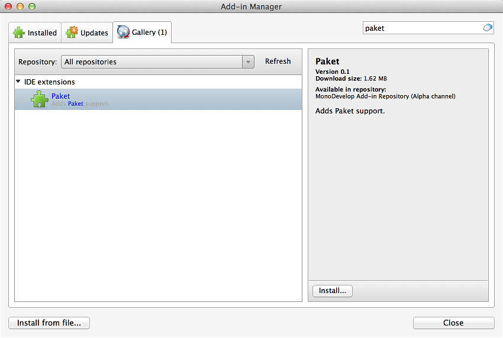
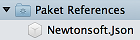
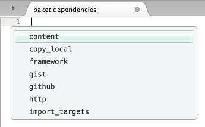
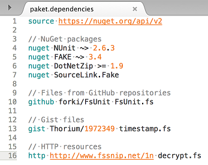

# Paket Support for MonoDevelop and Xamarin Studio

Provides [Paket](http://fsprojects.github.io/Paket/) support for MonoDevelop and Xamarin Studio.

For more details see the [Paket Support in Xamarin Studio blog post](http://lastexitcode.com/blog/2015/06/09/PaketSupportInXamarinStudio/)

# Features Overview

 * View dependencies and referenced NuGet packages in the Solution window.
 * Add, remove, update NuGet packages from the Solution window.
 * Install, restore, simplify NuGet packages from the Solution window.
 * Check for updated NuGet packages from the Solution window.
 * Syntax highlighting for all paket files.
 * Code completion whilst editing the paket.dependencies file.
 * Integrates with Xamarin Studio's unified search.
 * paket.dependencies and paket.template file templates.

# Requirements

 * MonoDevelop 5 or Xamarin Studio 5

# Installation

The addin is available from the [MonoDevelop addin repository](http://addins.monodevelop.com/). To install the addin:

 * Open the **Add-in Manager** dialog.
 * Select the **Gallery** tab.
 * Select **Xamarin Studio Add-in Repository (Alpha channel)** from  the drop down list.
 * Expand **IDE extensions**.
 * Select **Paket**.
 * Click the **Refresh** button if the addin is not visible.
 * Click **Install...** to install the addin.

# Features

In the following sections the features are covered in more detail.

## Adding a NuGet Package

To add a NuGet package using Paket, right click the project in the Solution window, and select **Add** - **Add NuGet Packages using Paket**.

The **Add NuGet Packages using Paket** menu is also available from the main Project menu.

## Paket Dependencies Folder

The Paket Dependencies folder is shown in the Solution window if Xamarin Studio finds a paket.dependencies file in the same directory as the solution. The NuGet packages that are in the paket.dependencies file are shown under this folder.

Double clicking the folder will open the paket.dependencies file into the text editor. The Paket Dependencies folder also has a context menu where you can run Paket commands. From the context menu you can Add a NuGet Package as a dependency, install, restore, update, and simplify your dependencies, or check for updates.

To update a single NuGet package you can right click it and select Update. To remove the NuGet package as a dependency you can right click it and select Remove or press delete.

## Paket References Folder

The Paket References folder is shown in the Solution window if Xamarin Studio finds a paket.references file in the same directory as the project. The NuGet packages that are in the paket.references file are shown under this folder. Double clicking the folder will open the paket.references file into the text editor.

Right clicking the Paket References folder allows you to add a NuGet package to the project. A NuGet package can be removed by right clicking it and selecting Remove or by pressing Delete.

## Code Completion

When editing the paket.dependencies file you will get code completion as you type. You can also bring up the code completion list by pressing Ctrl+Enter.

## Running Paket Commands

Paket commands can be run from the Unified search. If you type in paket you will see some of the Paket commands.

## Syntax Highlighting

Syntax highlighting is available for all paket files - paket.dependencies, paket.references, paket.lock and paket.template.

